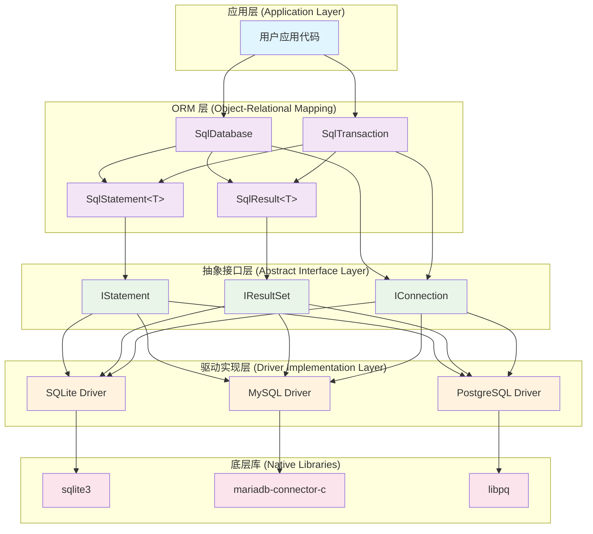
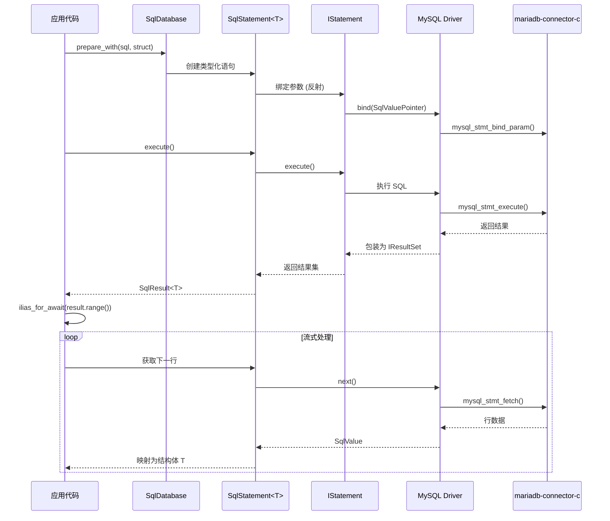

# IliasSql

<!-- CI Status Badges -->
[](https://github.com/Btk-Project/IliasMySql/actions/workflows/xmake-test-on-linux.yml)
[](https://github.com/Btk-Project/IliasMySql/actions/workflows/xmake-test-on-cl.yml)

<!-- Project Info Badges -->
[](LICENSE)
[](https://en.cppreference.com/w/cpp/20)
[](https://xmake.io)
[](https://github.com/Btk-Project/IliasMySql)
[](https://github.com/Btk-Project/IliasMySql)

**IliasSql** 是一个基于 C++20 协程的现代异步 SQL 客户端库，作为 `Ilias` 框架的数据访问层。它采用统一的抽象接口设计，支持多种数据库后端（SQLite、MySQL/MariaDB、PostgreSQL），提供类型安全的参数绑定、零拷贝的结果集处理，以及基于反射的对象关系映射。

## 设计理念

### 统一抽象，多后端支持
IliasSql 采用分层架构设计，通过抽象接口 (`IConnection`、`IStatement`、`IResultSet`) 屏蔽不同数据库的实现差异，为上层提供一致的编程体验。无论是 SQLite 的嵌入式场景，还是 MySQL 的网络数据库，都使用相同的 API。

### 协程优先，真正异步
基于 C++20 协程和 `ilias::Task` 系统，所有 I/O 操作都是非阻塞的。与传统的回调或 Future 模式不同，协程让异步代码看起来像同步代码，避免了回调地狱，同时保持了高性能。

### 类型安全，编译期检查
通过模板元编程和反射机制，在编译期验证 SQL 占位符与参数的匹配性。`prepare_with` 系列接口能够检查结构体字段数量与 SQL 参数数量的一致性，避免运行时绑定错误。

### 零拷贝，内存高效
结果集处理采用视图 (`SqlValueView`) 和生成器 (`Generator`) 模式，避免不必要的数据拷贝。流式处理大结果集时，内存占用保持恒定，不会因数据量增长而线性增长。

### 反射驱动，代码简洁
基于 NekoProtoTools 反射库，支持 C++ 结构体与数据库记录的自动映射。无需手写繁琐的字段绑定代码，结构体定义即是数据模型。

## 核心特性

### 🚀 异步协程架构
- **真正的非阻塞 I/O**: 基于 `ilias::Task` 和 C++20 `co_await`，所有数据库操作都不会阻塞线程
- **协程友好**: 使用 `ilias_for_await` 进行流式结果集遍历，代码简洁直观
- **高并发支持**: 单线程处理大量并发数据库连接，资源利用率高

### 🔌 统一多后端接口
- **SQLite3**: 支持文件数据库和内存数据库模式
- **MySQL/MariaDB**: 使用原生异步 C API，支持连接池
- **PostgreSQL**: 基于 libpq 的异步实现（开发中）
- **插件化架构**: 通过抽象接口轻松扩展新的数据库驱动

### 🛡️ 类型安全与反射
- **编译期检查**: `prepare_with` 在编译期验证 SQL 占位符与参数数量的匹配
- **结构体映射**: 支持 C++ 结构体与数据库记录的双向自动映射
- **类型推导**: 自动推导参数类型，减少显式类型声明
- **空值处理**: 原生支持 `std::optional` 和 `SqlNull` 类型

### ⚡ 高性能设计
- **零拷贝结果集**: 使用 `SqlValueView` 避免不必要的数据拷贝
- **流式处理**: `Generator` 模式支持大结果集的恒定内存消耗
- **预编译语句复用**: 支持语句重置和参数重新绑定
- **批量操作优化**: 事务内批量插入性能优异

### 🔧 开发者友好
- **RAII 事务管理**: 自动回滚，手动提交，异常安全
- **丰富的错误信息**: 基于 `std::error_code` 的错误处理体系
- **调试支持**: 内置日志追踪，便于问题定位
- **现代 C++ 风格**: 充分利用 C++20 特性，代码表达力强

## 架构设计

### 分层架构



### 数据流示意



### 核心接口设计

#### IConnection - 连接抽象
```cpp
class IConnection {
virtual auto sqlname() -> std::string                              = 0;
    virtual auto sqlinfo() -> std::string                              = 0;
    virtual auto connect() -> IoTask<void>                             = 0;
    virtual auto disconnect() -> IoTask<void>                          = 0;
    virtual auto selectDatabase(std::string_view name) -> IoTask<void> = 0;

    // 预编译 SQL
    virtual auto prepare(std::string_view sql) -> IoTask<std::unique_ptr<IStatement>> = 0;

    // 直接执行 SQL
    virtual auto execute(std::string_view sql) -> IoTask<size_t>                    = 0;
    virtual auto query(std::string_view sql) -> IoTask<std::unique_ptr<IResultSet>> = 0;

    // 事务控制
    virtual auto beginTransaction() -> IoTask<bool> = 0;
    virtual auto commit() -> IoTask<bool>           = 0;
    virtual auto rollback() -> IoTask<bool>         = 0;
    virtual auto syncRollback() -> bool             = 0;

    // 获取最后一次插入的 ID
    virtual auto lastInsertId() const -> int64_t = 0;

    // 类型转换上下文
    virtual auto valueConverterContext() const -> std::shared_ptr<SqlValueConverterContext> = 0;

    // 连通性检测
    virtual auto ping() -> IoTask<bool>         = 0;
    virtual auto nativeHandle() const -> void * = 0;
};
```

#### IStatement - 预编译语句抽象
```cpp
class IStatement {
    virtual auto query() -> IoTask<std::unique_ptr<IResultSet>> = 0;
    virtual auto execute() -> IoTask<size_t> = 0;
    virtual auto reset() -> void                = 0;
    virtual auto nativeHandle() const -> void * = 0;
        virtual auto bind(std::type_index type_index, size_t index, const SqlCellView &value) -> IoResult<void> = 0;
    virtual auto bind(std::type_index type_index, std::string_view name, const SqlCellView &value)
        -> IoResult<void> = 0;
};
```

#### IResultSet - 结果集抽象
```cpp
class IResultSet {
    virtual auto next() -> IoTask<bool> = 0;
    virtual auto rowCount() const -> size_t = 0;
    virtual auto columnCount() const -> size_t                      = 0;
    virtual auto columnName(size_t index) const -> std::string_view = 0;
    virtual auto getValue(size_t index) -> IoResult<SqlCellView> = 0;
    virtual auto getValue(std::string_view name) -> IoResult<SqlCellView> = 0;
    virtual auto nativeHandle() const -> void *                           = 0;
};
```

### 类型系统设计

#### 通过注册类型解析和存储函数，实现高度可扩展的类型系统
```cpp
using SqlParserResult = IoResult<std::any>;
using SqlParserFunc   = std::function<SqlParserResult(const SqlCellView &)>;
using SqlBinderResult = IoResult<std::unique_ptr<void, void (*)(void *)>>;

void registerTypeParsers(SqlValueConverterContext &context) {
    // 注册NULL类型解析器
    context.registerType<SqlNull>(&pq_parse_null);

    // 注册NULL类型绑定器
    context.registerType<SqlNull>(&pq_bind_null);

    // 注册布尔类型解析器
    context.registerType<bool>(&pq_parse_bool);

    // 注册布尔类型绑定器
    context.registerType<bool>(&pq_bind_bool);
}
```

#### 反射驱动的映射
```cpp
struct User {
    int64_t id;
    std::string name;
    std::optional<int> age;
};

// 通过反射自动生成绑定代码
template<> struct Meta<User, void> {
    constexpr static auto value = Object(
        "id", &User::id,
        "name", &User::name, 
        "age", &User::age
    );
};
```

## SqlTags 增强功能

IliasSql 现在包含了强大的 SqlTags 系统，用于声明式数据库模式定义：

### 核心特性

- **约束管理**: 主键、唯一性、非空、自增、索引等数据库约束
- **类型修饰符**: 无符号类型、字符串长度等数据类型优化
- **时间戳自动化**: 自动创建时间和更新时间管理
- **跨数据库兼容**: 自动生成适配不同数据库的 SQL 语句
- **配置验证**: 编译期和运行时配置验证，确保模式正确性
- **模式生成**: 从 SqlTags 配置自动生成 CREATE TABLE 语句

### 快速示例

```cpp
struct User {
    int64_t id;
    std::string username;
    std::string email;
    SqlDate created_at;
    SqlDate updated_at;
};

NEKO_BEGIN_NAMESPACE
template<> struct Meta<User, void> {
    constexpr static auto value = Object(
        "id", make_tags<SqlTags{
            .primary_key = true,
            .auto_increment = true
        }>(&User::id),
        
        "username", make_tags<SqlTags{
            .not_null = true,
            .unique = true,
            .length = 50
        }>(&User::username),
        
        "email", make_tags<SqlTags{
            .not_null = true,
            .unique = true,
            .length = 255
        }>(&User::email),
        
        "created_at", make_tags<SqlTags{
            .not_null = true,
            .created_at = true
        }>(&User::created_at),
        
        "updated_at", make_tags<SqlTags{
            .not_null = true,
            .updated_at = true
        }>(&User::updated_at)
    );
};
NEKO_END_NAMESPACE
```

### 文档资源

#### 生成 API 文档

项目使用 Doxygen 生成 API 文档。要生成文档，请确保已安装 Doxygen：

```bash
# 安装 Doxygen (Ubuntu/Debian)
sudo apt-get install doxygen graphviz

# 安装 Doxygen (macOS)
brew install doxygen graphviz

# 安装 Doxygen (Windows)
# 从 https://www.doxygen.nl/download.html 下载安装
```

生成文档：

```bash
# 在项目根目录执行
doxygen Doxyfile

# 文档将生成到 docs/html 目录
# 使用浏览器打开 docs/html/index.html 查看
```

#### 相关文档

- **[PostgreSQL 重构总结](docs/postgres_refactor_summary.md)** - PostgreSQL 驱动的重构说明

### 自动模式生成

```cpp
// 自动生成数据库模式
auto createTableSQL = SchemaGenerator<MysqlTag>::generateCreateTable<User>("users");
co_await db.execute(createTableSQL);

// 生成的 SQL (MySQL):
// CREATE TABLE `users` (
//   `id` BIGINT AUTO_INCREMENT PRIMARY KEY,
//   `username` VARCHAR(50) NOT NULL UNIQUE KEY,
//   `email` VARCHAR(255) NOT NULL UNIQUE KEY,
//   `created_at` DATETIME NOT NULL DEFAULT CURRENT_TIMESTAMP,
//   `updated_at` DATETIME NOT NULL ON UPDATE CURRENT_TIMESTAMP
// )
```

## 快速开始

### 环境依赖
- **C++20 编译器**: GCC 10+, Clang 12+, MSVC 2022+
- **核心依赖**:
  - [Ilias](https://github.com/BusyStudent/Ilias) 框架 (协程和 IO 系统)
  - [NekoProtoTools](https://github.com/liuli-neko/NekoProtoTools) (反射支持)
- **数据库驱动**: SQLite3 / MariaDB Client Library / libpq
- **构建系统**: Xmake (推荐) 或 CMake

### 安装配置
```bash
# 使用 xmake 构建
xmake config --enable_mysql=true --enable_sqlite=sqlite --enable_postgres=false
xmake build

# 或者禁用某些后端以减少依赖
xmake config --enable_mysql=false --enable_sqlite=sqlite
xmake build
```

### 基础用法

#### 1. 引入头文件与命名空间

```cpp
#include <ilias/platform.hpp>
#include <ilias/sql/sqldatabase.hpp>
#include <ilias/sql/types.hpp>

using namespace ilias;
using namespace ilias::sql;
```

#### 2. 定义数据模型（基于反射）

利用反射库，结构体定义即是数据模型，无需额外的映射代码：

```cpp
struct User {
    int64_t     id;
    std::string name;
    std::optional<int> age;        // 支持可空字段
    SqlDate     created_at;        // 内置时间类型
};

// 反射元数据定义（一次性配置）
NEKO_BEGIN_NAMESPACE
template<> struct Meta<User, void> {
    constexpr static auto value = Object(
        "id", make_tags<SqlTags{.primary_key = true}>(&User::id),
        "name", make_tags<SqlTags{.not_null = true}>(&User::name),
        "age", &User::age,
        "created_at", &User::created_at
    );
};
NEKO_END_NAMESPACE
```

#### 3. 建立数据库连接（工厂模式）

```cpp
IoTask<void> database_example() {
    // MySQL/MariaDB 连接
    ConnectOptions mysql_options;
    mysql_options.host = "127.0.0.1";
    mysql_options.port = 3306;
    mysql_options.user = "root";
    mysql_options.password = "secret";
    mysql_options.database = "test_db";
    
    auto db_result = co_await SqlDatabase::open("mysql", mysql_options);
    
    // SQLite 连接（文件或内存）
    // auto db_result = co_await SqlDatabase::open_in_memory();  // 内存数据库
    // ConnectOptions sqlite_options;
    // sqlite_options.filename = "test.db";
    // auto db_result = co_await SqlDatabase::open("sqlite", sqlite_options);
    
    if (!db_result) {
        ILIAS_ERROR("DB", "连接失败: {}", db_result.error().message());
        co_return;
    }
    
    SqlDatabase db = std::move(db_result.value());
    // 后续操作...
}
```

#### 4. 类型安全的参数绑定

`prepare_with` 系列接口提供编译期类型检查，确保参数与 SQL 占位符匹配：

```cpp
// 结构体绑定 - 自动映射字段到占位符
User new_user{0, "Alice", 25, SqlDate(std::chrono::system_clock::now())};

// 编译期检查：确保结构体字段数量与 SQL 占位符数量一致
auto stmt_result = co_await db.prepare_with(
    "INSERT INTO users (id, name, age, created_at) VALUES (:id, :name, :age, :created_at)", 
    new_user
);

if (stmt_result) {
    auto stmt = std::move(stmt_result.value());
    auto rows_affected = co_await stmt.execute();
    std::cout << "插入行数: " << rows_affected.value() << std::endl;
}

// 多参数绑定 - 按位置绑定
auto stmt2 = co_await db.prepare_with(
    "SELECT * FROM users WHERE age > ? AND name LIKE ?", 
    18, std::string("%Alice%")
);
```

#### 5. 流式结果集处理

使用生成器模式进行内存高效的结果集遍历：

```cpp
// 类型化查询 - 自动映射到结构体
auto query_result = co_await db.query<User>("SELECT * FROM users WHERE age > 18");

if (query_result) {
    auto result = std::move(query_result.value());
    
    // 流式异步迭代 - 逐行处理，内存占用恒定
    ilias_for_await(auto& user, result.range()) {
        std::cout << "用户: " << user.name 
                  << ", 年龄: " << user.age.value_or(0)
                  << ", 创建时间: " << user.created_at.toString() << std::endl;
    }
}

// 多列查询 - 元组形式
auto multi_result = co_await db.query<std::string, int>("SELECT name, age FROM users");
if (multi_result) {
    ilias_for_await(auto& [name, age], multi_result.value().range()) {
        std::cout << name << " is " << age << " years old" << std::endl;
    }
}

// 手动列访问 - 灵活处理
auto raw_result = co_await db.query("SELECT * FROM users");
if (raw_result) {
    auto result = std::move(raw_result.value());
    ilias_for_await(auto _, result.range()) {
        std::string name;
        int age;
        result.load("name", name);
        result.load("age", age);
        std::cout << "手动加载: " << name << ", " << age << std::endl;
    }
}
```

#### 6. 事务管理（RAII 模式）

事务对象采用 RAII 设计，确保异常安全：

```cpp
auto tx_result = co_await db.transaction();
if (tx_result) {
    auto tx = std::move(tx_result.value());
    
    try {
        // 在事务中执行多个操作
        co_await tx.execute("UPDATE users SET age = age + 1 WHERE id = 1");
        co_await tx.execute("DELETE FROM logs WHERE date < '2023-01-01'");
        
        // 条件性操作
        auto count_result = co_await tx.query<int>("SELECT COUNT(*) FROM users WHERE age > 65");
        if (count_result && count_result.value().range().begin() != count_result.value().range().end()) {
            // 如果有老年用户，执行特殊逻辑
            co_await tx.execute("INSERT INTO senior_users SELECT * FROM users WHERE age > 65");
        }
        
        // 手动提交事务
        co_await tx.commit();
        std::cout << "事务提交成功" << std::endl;
        
    } catch (const std::exception& e) {
        // 异常时自动回滚（析构函数处理）
        std::cerr << "事务执行失败: " << e.what() << std::endl;
        // tx 析构时自动调用 rollback()
    }
}
// 如果 tx 对象析构时未调用 commit()，会自动执行 rollback()
```

#### 7. 高级特性示例

```cpp
// 批量插入优化
auto tx = (co_await db.transaction()).value();
auto stmt = (co_await tx.prepare<User>("INSERT INTO users VALUES (:id, :name, :age, :created_at)")).value();

std::vector<User> users = /* ... 大量用户数据 ... */;
for (const auto& user : users) {
    stmt.reset();  // 重置语句状态
    stmt.bind(user);  // 重新绑定参数
    co_await stmt.execute();
}
co_await tx.commit();

// 复杂查询与条件绑定
struct QueryParams {
    std::optional<int> min_age;
    std::optional<std::string> name_pattern;
    SqlDate start_date;
};

QueryParams params{18, "%John%", SqlDate(2023, 1, 1)};
auto complex_result = co_await db.prepare_with(
    "SELECT * FROM users WHERE age >= :min_age AND name LIKE :name_pattern AND created_at >= :start_date",
    params
);
```

## API 参考

### 核心类概览

#### `SqlDatabase` - 数据库连接管理器
数据库操作的主入口，采用工厂模式创建连接：

```cpp
class SqlDatabase {
public:
    // 工厂方法 - 创建数据库连接
    static auto open(std::string_view driver, ConnectOptions options) -> IoTask<SqlDatabase>;
    static auto open_in_memory() -> IoTask<SqlDatabase>;  // SQLite 内存数据库
    
    // 直接执行 SQL
    auto execute(std::string_view sql) -> IoTask<size_t>;
    auto query<T>(std::string_view sql) -> IoTask<SqlResult<T>>;
    
    // 预编译语句
    auto prepare<T>(std::string_view sql) -> IoTask<SqlStatement<T>>;
    auto prepare_with(SqlCheck<T> sql, T&& args) -> IoTask<SqlStatement<T>>;
    
    // 事务管理
    auto transaction() -> IoTask<SqlTransaction>;
    
    // 连接管理
    auto close() -> IoTask<void>;
};
```

**设计理念**: 
- 工厂模式隐藏驱动差异，统一创建接口
- 模板化的查询接口提供编译期类型安全
- RAII 管理连接生命周期

#### `SqlStatement<T>` - 类型化预编译语句
预编译语句对象，`T` 为绑定的参数类型：

```cpp
template<typename T>
class SqlStatement {
public:
    // 参数绑定
    auto bind(T&& args) -> IoResult<void>;                    // 结构体绑定
    auto bind(Args&&... args) -> IoResult<void>;              // 多参数绑定
    
    // 执行操作
    auto execute() -> IoTask<size_t>;                         // 写操作，返回影响行数
    auto query() -> IoTask<SqlResult<T>>;                     // 读操作，返回结果集
    
    // 语句管理
    auto reset() -> void;                                     // 重置状态以复用
    auto clearKeepAlives() -> void;                           // 清理内部缓存
};
```

**设计理念**:
- 模板参数 `T` 提供编译期类型约束
- `reset()` 支持语句复用，提高批量操作性能
- 内部 `mKeepAlive` 机制确保绑定参数的生命周期安全

#### `SqlResult<T>` - 类型化结果集
查询结果集，`T` 为映射的目标类型：

```cpp
template<typename T>
class SqlResult {
public:
    // 流式遍历 - 生成器模式
    auto range() -> Generator<T>;                             // 自动映射到类型 T
    auto range(Args&... args) -> Generator<IoResult<void>>;   // 手动绑定到变量
    
    // 手动列访问
    auto load(int index, U& value) -> IoResult<void>;
    auto load(std::string_view name, U& value) -> IoResult<void>;
    
    // 底层结果集访问
    auto operator->() -> IResultSet*;
    auto columnCount() const -> size_t;
    auto rowCount() const -> size_t;
};
```

**设计理念**:
- `Generator<T>` 实现流式处理，内存占用恒定
- 支持自动映射和手动访问两种模式
- 零拷贝的 `SqlValueView` 避免不必要的数据复制

#### `SqlTransaction` - RAII 事务管理器
事务对象，确保原子性和异常安全：

```cpp
class SqlTransaction {
public:
    // 事务操作 - 与 SqlDatabase 接口一致
    auto execute(std::string_view sql) -> IoTask<size_t>;
    auto query<T>(std::string_view sql) -> IoTask<SqlResult<T>>;
    auto prepare<T>(std::string_view sql) -> IoTask<SqlStatement<T>>;
    
    // 事务控制
    auto commit() -> IoTask<void>;                            // 手动提交
    auto rollback() -> IoTask<void>;                          // 手动回滚
    
    // 析构函数自动回滚未提交的事务
    ~SqlTransaction();
};
```

**设计理念**:
- RAII 确保异常安全，析构时自动回滚
- 与 `SqlDatabase` 保持一致的接口，降低学习成本
- 状态机管理事务生命周期，防止重复操作

### 类型系统

#### 统一值类型体系
所有类型统一通过 `SqlCellView` 传递，抹除类型差异，并通过动态注册转化函数来实现类型的高度兼容性。

#### 通用时间类型支持
```cpp
struct SqlDate {
    enum TimeType { kDate, kDateTime, kTime };
    
    // 多种构造方式
    SqlDate(int year, int month, int day, int hour = 0, int minute = 0, int second = 0);
    SqlDate(std::chrono::system_clock::time_point tp);
    SqlDate(std::string_view iso_string);
    
    auto        fromUTCString(std::string_view str) -> void;
    auto        fromLocalString(std::string_view str) -> void;
    auto        toUTCString() const -> std::string;
    auto        toLocalString() const -> std::string;
    auto        to_time_point() const -> std::chrono::system_clock::time_point;
    auto        toTimestamp() const -> uint64_t;
    /// ...    
};
```

### 错误处理

IliasSql 采用现代 C++ 的错误处理模式：

```cpp
// 基于 Result<T, std::error_code> 的错误处理
auto result = co_await db.execute("INVALID SQL");
if (!result) {
    std::error_code ec = result.error();
    std::cout << "错误码: " << ec.value() << std::endl;
    std::cout << "错误信息: " << ec.message() << std::endl;
    
    // 错误分类处理
    if (ec.category() == sql_error_category()) {
        // SQL 相关错误
    } else if (ec.category() == std::system_category()) {
        // 系统错误
    }
}
```

**设计理念**:
- 避免异常的性能开销，使用 `Result<T, E>` 模式
- 标准化的 `std::error_code` 便于错误分类和处理
- 协程友好，错误传播不会破坏协程链

## 构建与测试

### 构建配置

项目使用 Xmake 作为构建系统，支持模块化配置：

```bash
# 查看所有配置选项
xmake config --help

# 完整功能构建（默认）
xmake config --enable_mysql=true --enable_sqlite=sqlite --enable_postgres=false --enable_orm_interface=true
xmake build

# 最小化构建（仅 SQLite）
xmake config --enable_mysql=false --enable_sqlite=sqlite --enable_postgres=false
xmake build

# 启用测试
xmake config --enable_test=true
xmake build
```

### 模块选项说明

| 选项 | 默认值 | 说明 |
|------|--------|------|
| `enable_mysql` | `true` | MySQL/MariaDB 支持，需要 mariadb-connector-c |
| `enable_sqlite` | `sqlite` | SQLite 支持，可选 `sqlite`/`sqlcipher`/`disable` |
| `enable_postgres` | `false` | PostgreSQL 支持，需要 libpq |
| `enable_orm_interface` | `true` | ORM 接口支持 |
| `dynamic_plugin` | `false` | 构建为动态插件 |
| `enable_test` | `false` | 启用单元测试 |

### 运行测试

```bash
# SQLite 测试（无需外部依赖）
xmake build test_sqlite
xmake run test_sqlite

# MySQL 测试（需要 MySQL 服务）
xmake build test_mysql
xmake run test_mysql
```

### MySQL 测试环境配置

测试使用环境变量配置数据库连接：

```bash
# 环境变量配置
export DB_HOST=127.0.0.1
export DB_PORT=3306
export DB_USER=root
export DB_PASS=root
export DB_NAME=test_db

# 使用 Docker 快速启动 MySQL
docker run --name ilias-test-mysql \
  -e MYSQL_ROOT_PASSWORD=root \
  -e MYSQL_DATABASE=test_db \
  -p 3306:3306 -d mysql:8.0

# 等待服务启动后运行测试
sleep 10
xmake run test_mysql
```

### CI/CD 说明

项目在 GitHub Actions 上运行持续集成：

- **Linux CI**: 使用 Ubuntu 最新版，测试 GCC 和 Clang 编译器
- **Windows CI**: 使用 Windows Server 2022，测试 MSVC 编译器
- **数据库测试**: 自动配置 MySQL 服务，运行完整的数据库测试套件

Windows CI 特殊处理：
- 使用 `127.0.0.1` 而非 `localhost` 避免 IPv6 解析问题
- 循环检测 `mysqladmin ping` 确保服务就绪
- 创建并授权 `root@127.0.0.1` 用户以提高连接稳定性

## 性能特性

### 异步 I/O 优势

传统同步数据库操作会阻塞线程，限制并发能力：

```cpp
// 传统同步方式 - 阻塞线程
void sync_example() {
    auto conn = create_connection();
    auto result1 = conn.query("SELECT * FROM table1");  // 阻塞等待
    auto result2 = conn.query("SELECT * FROM table2");  // 继续阻塞
    // 总耗时 = query1_time + query2_time
}

// IliasSql 异步方式 - 非阻塞
IoTask<void> async_example() {
    auto db = co_await SqlDatabase::open("mysql", options);
    
    // 并发执行多个查询
    auto [result1, result2] = co_await when_all(
        db.query<Table1>("SELECT * FROM table1"),
        db.query<Table2>("SELECT * FROM table2")
    );
    // 总耗时 ≈ max(query1_time, query2_time)
}
```

### 内存效率

流式结果集处理避免了大结果集的内存爆炸：

```cpp
// 传统方式 - 一次性加载所有数据到内存
std::vector<User> load_all_users() {
    auto result = db.query("SELECT * FROM users");  // 假设有百万用户
    std::vector<User> users;
    // 内存占用: 百万用户 × sizeof(User)
    while (result.next()) {
        users.push_back(result.get<User>());
    }
    return users;  // 峰值内存翻倍
}

// IliasSql 流式处理 - 恒定内存占用
IoTask<void> process_users_streaming() {
    auto result = co_await db.query<User>("SELECT * FROM users");
    
    // 内存占用: 恒定 ≈ sizeof(User)
    ilias_for_await(auto& user, result.range()) {
        process_user(user);  // 逐个处理，不累积内存
    }
}
```

### 批量操作优化

预编译语句复用显著提升批量操作性能：

```cpp
IoTask<void> batch_insert_optimized() {
    auto tx = co_await db.transaction();
    auto stmt = co_await tx.prepare<User>("INSERT INTO users VALUES (:id, :name, :age, :created_at)");
    
    std::vector<User> users = generate_test_users(10000);
    
    auto start = std::chrono::high_resolution_clock::now();
    
    for (const auto& user : users) {
        stmt.reset();        // 重置语句状态 - 高效
        stmt.bind(user);     // 重新绑定参数
        co_await stmt.execute();
    }
    
    co_await tx.commit();
    
    auto duration = std::chrono::high_resolution_clock::now() - start;
    // 相比每次重新 prepare，性能提升 5-10 倍
}
```

### 零拷贝数据访问

`SqlValueView` 避免了字符串和二进制数据的不必要拷贝：

```cpp
IoTask<void> zero_copy_example() {
    auto result = co_await db.query("SELECT large_text, binary_data FROM documents");
    
    ilias_for_await(auto _, result.range()) {
        // 零拷贝访问 - 直接引用数据库驱动的内存
        std::string_view text;      // 不拷贝字符串内容
        SqlBlobView blob;           // 不拷贝二进制数据
        
        result.load("large_text", text);
        result.load("binary_data", blob);
        
        // 直接处理视图数据，无内存分配
        process_text(text);
        process_blob(blob);
    }
}
```

## 最佳实践

### 连接管理

```cpp
// 推荐：使用连接池（在应用层实现）
class DatabasePool {
    std::vector<SqlDatabase> connections;
    std::queue<size_t> available;
    std::mutex mutex;
    
public:
    auto acquire() -> IoTask<SqlDatabase&> {
        // 从池中获取可用连接
        // 实现连接复用逻辑
    }
    
    auto release(SqlDatabase& db) -> void {
        // 归还连接到池中
    }
};

// 避免：频繁创建销毁连接
IoTask<void> bad_practice() {
    for (int i = 0; i < 1000; ++i) {
        auto db = co_await SqlDatabase::open("mysql", options);  // 昂贵操作
        co_await db.execute("INSERT INTO logs VALUES (...)");
        // db 析构，连接关闭
    }
}
```

### 事务使用

```cpp
// 推荐：合理的事务边界
IoTask<void> good_transaction() {
    auto tx = co_await db.transaction();
    
    // 相关操作放在同一事务中
    auto user_id = co_await tx.execute_with("INSERT INTO users VALUES (:name)", user);
    co_await tx.execute_with("INSERT INTO profiles VALUES (:user_id, :data)", user_id, profile);
    
    co_await tx.commit();  // 原子性保证
}

// 避免：长时间持有事务
IoTask<void> bad_transaction() {
    auto tx = co_await db.transaction();
    
    co_await tx.execute("UPDATE accounts SET balance = balance - 100 WHERE id = 1");
    
    // 长时间的外部操作 - 持有锁过久
    co_await call_external_api();
    co_await complex_computation();
    
    co_await tx.execute("UPDATE accounts SET balance = balance + 100 WHERE id = 2");
    co_await tx.commit();  // 可能导致死锁或性能问题
}
```

### 错误处理

```cpp
// 推荐：分层错误处理
IoTask<Result<User, AppError>> get_user_safe(int64_t id) {
    auto result = co_await db.query<User>("SELECT * FROM users WHERE id = ?", id);
    
    if (!result) {
        auto ec = result.error();
        if (ec.category() == sql_error_category()) {
            // SQL 错误 - 记录日志，返回业务错误
            ILIAS_ERROR("db", "查询用户失败: {}", ec.message());
            co_return AppError::DatabaseError;
        } else {
            // 系统错误 - 可能需要重试
            co_return AppError::SystemError;
        }
    }
    
    auto users = std::move(result.value());
    ilias_for_await(auto& user, users.range()) {
        // 如果id不是唯一或关键键可能还需要处理有多个结果的情况
        co_return user;    
    }
    co_return AppError::UserNotFound;  // 业务层错误    
}
```
## 路线图

### 已完成特性 ✅
- [x] **核心异步框架**: 基于 C++20 协程的完整异步 I/O 体系
- [x] **多数据库支持**: SQLite3、MySQL/MariaDB 驱动实现
- [x] **类型安全绑定**: 编译期参数检查和结构体反射映射
- [x] **流式结果集**: 基于生成器的内存高效数据处理
- [x] **RAII 事务管理**: 异常安全的事务控制
- [x] **零拷贝优化**: SqlValueView 和 SqlBlobView 视图类型
- [x] **完整测试覆盖**: 单元测试和集成测试，CI/CD 流水线

### 开发中特性 🚧
- [ ] **PostgreSQL 驱动**: 基于 libpq 的异步实现
  - [x] 核心接口已定义，驱动实现进行中
  - [ ] 绑定和获取数据采用数据流，而非字符串
  - [ ] 完善数据库option设置

### 计划中特性 📋
- [x] **基于raii的事务支持orm层**

### 长期目标 🎯
- [ ] **更多数据库驱动**:
  - Redis (作为缓存层集成)
  - ClickHouse (分析型数据库)
  - TiDB (分布式数据库)

### 贡献指南

我们欢迎社区贡献！如果你对以上特性感兴趣，可以：

1. **提交 Issue**: 讨论新特性的设计和实现方案
2. **代码贡献**: Fork 项目并提交 Pull Request
3. **文档完善**: 改进文档、示例和教程
4. **测试用例**: 增加测试覆盖率，特别是边界情况

**开发环境要求**:
- C++20 兼容编译器 (GCC 10+, Clang 12+, MSVC 2022+)
- Xmake 构建系统
- 对应数据库的开发库 (libsqlite3-dev, libmariadb-dev, libpq-dev)

**代码风格**:
- 遵循现有的代码风格和命名约定
- 使用现代 C++ 特性，避免 C 风格代码
- 添加适当的注释和文档
- 确保所有测试通过

## 许可证

本项目采用 [MIT 许可证](LICENSE)，允许自由使用、修改和分发。

## 致谢

- [Ilias 框架](https://github.com/BusyStudent/Ilias) - 提供协程和 I/O 基础设施
- [NekoProtoTools](https://github.com/liuli-neko/NekoProtoTools) - 提供反射和序列化支持
- [MariaDB Connector/C](https://mariadb.com/kb/en/mariadb-connector-c/) - MySQL/MariaDB 客户端库
- [SQLite](https://www.sqlite.org/) - 嵌入式数据库引擎
- [PostgreSQL libpq](https://www.postgresql.org/docs/current/libpq.html) - PostgreSQL 客户端库

感谢所有贡献者和社区成员的支持！